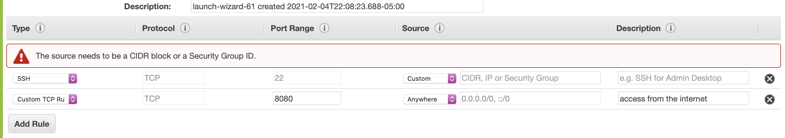
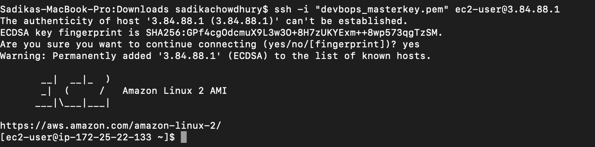
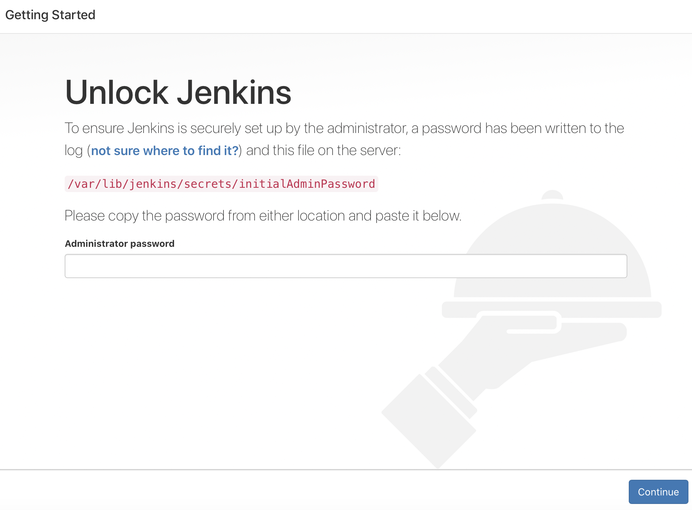
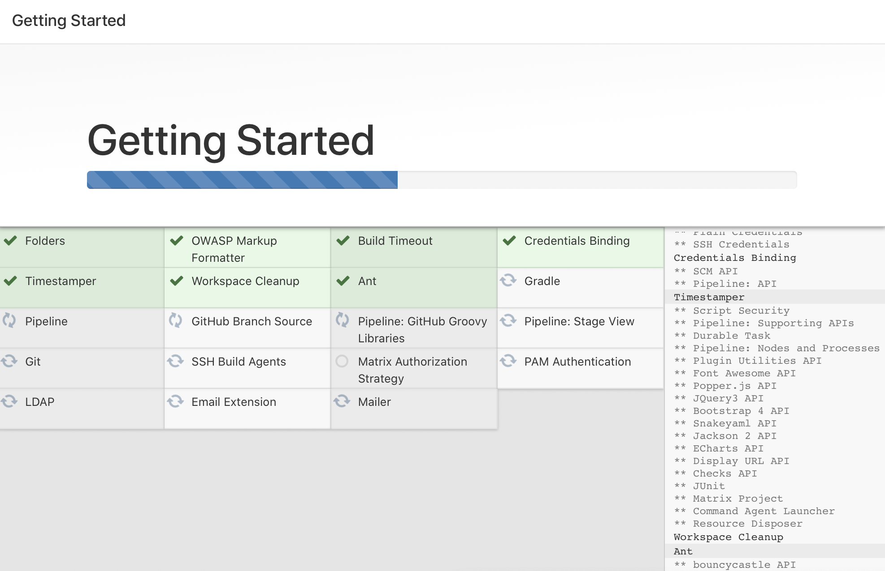

# Jenkins-EC2
How to set up Jenkins on AWS EC2 step by step 

> 1. Launch a EC2 on a public subnet and make sure that you have a SSH rule for yourself and also open up port 8080 on the server so that you can access Jenkins from the web.

 

> 2. SSH into your EC2 machine 

 

 

> 3. Once you ssh into your EC2 machine, run the following commands:
* sudo yum update –y (This command updates the Linux operating system)
* sudo yum install java-1.8.0-openjdk-devel -y (This command installs the JAVA JDK which is use by Jenkins)
* sudo wget -O /etc/yum.repos.d/jenkins.repo https://pkg.jenkins.io/redhat/jenkins.repo (This command pulls Jenkins repo to our machine)
* sudo rpm --import https://pkg.jenkins.io/redhat/jenkins.io.key (This command imports a key file from Jenkins-CI to enable installation from the package)
*  sudo yum install jenkins -y (installing jenkins)
* sudo systemctl start jenkins (starting jenkins service)
* sudo systemctl enable jenkins (enabling the jenkins service across server restarts)
* sudo systemctl status jenkins (ensuring jenkins service is up and running)
 

> 4. The next step is to go to port 8080 of your server using your public IP address. If the following steps done correctly, you should see the following:
 

 

> 5. To unlock the initial admin password go back to your command line and run the command: 
* sudo cat /var/lib/jenkins/secrets/initialAdminPassword
> This command will return password back to you, then paste that password on to the Jenkins server
 

> 6. After sucessfully completing step 5 you should be able to continue to setting up your Jenkins server
 

 
